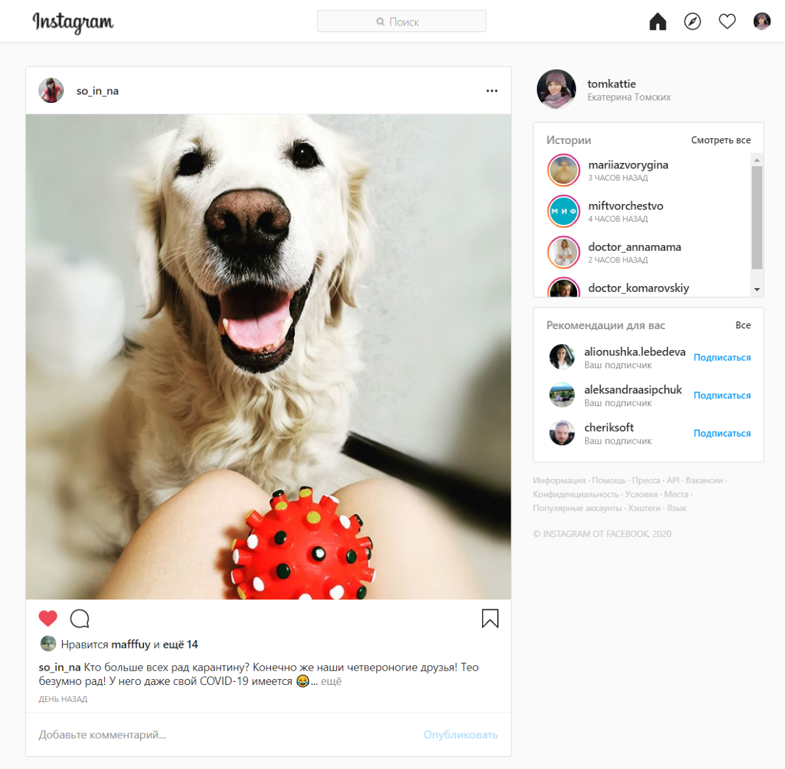

# Сценарий для автоматизации
В предыдущем задании я разбила критичный функционал на несколько сценариев, которые включают в себя набор атомарных тесткейсов.
Рассмотрим один из них - **просмотр контента**. 
Почему он самый критичный:
* Сама суть сервиса - обмен контентом, за этим пользователи и приходят.
* Instagram и бизнес-аккаунты зарабатывают на просмотрах.
* Потеря лояльности при неработоспособности этого функционала будут максимальна.
Рассматривать будем браузерную версию в Google Chrome.

# Тесткейсы
До запуска тесткейсов необходимо, чтобы:
1. Открылась страница https://www.instagram.com/
2. Пользователь был авторизован

Базовой страницей считаем эту:

